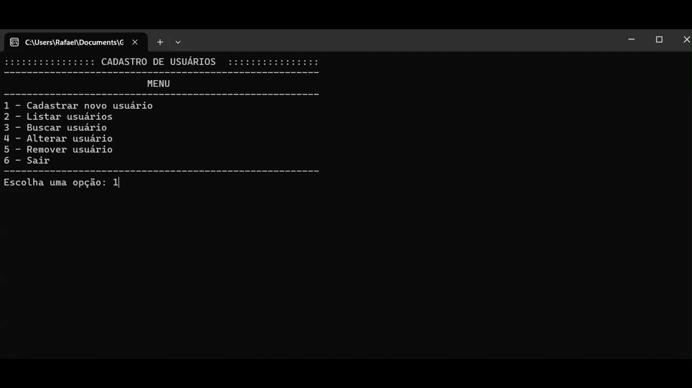

# 👥 User Management System — C# Console Application

&#x20;&#x20;

Aplicação de console desenvolvida em C# para gerenciamento de usuários, com foco em fundamentos de programação, Programação Orientada a Objetos (POO), manipulação de arquivos e persistência de dados em JSON.

O sistema permite cadastrar, listar, buscar, atualizar e remover usuários por meio de um menu interativo no terminal.

---

## 📸 Demonstração



---

## 🚀 Funcionalidades

- ✅ Cadastro de usuários
- ✅ Listagem de usuários cadastrados
- ✅ Busca de usuário por matrícula
- ✅ Alteração de dados de usuário
- ✅ Remoção de usuários
- ✅ Persistência de dados em arquivo JSON
- ✅ Controle de perfis com Enum
- ✅ Validação de entradas
- ✅ Estrutura orientada a objetos

---

## 🧠 Conceitos aplicados

Projeto desenvolvido com foco em prática dos fundamentos de desenvolvimento backend em C#.

- Programação Orientada a Objetos (POO básica)
- Classes e objetos
- Uso básico de classes e objetos
- Enumerações (`enum`)
- Manipulação de listas
- Estruturas condicionais e de repetição
- Serialização e desserialização JSON
- Persistência de dados em arquivo JSON
- Validação de entradas do usuário
- Organização de código em múltiplos arquivos (separação de modelos)
- Manipulação de arquivos com `System.IO`
- Gerenciamento de dependências com NuGet

---

## 🛠️ Tecnologias utilizadas

- C#
- .NET (SDK 10)
- Newtonsoft.Json
- Visual Studio

---

## 📂 Estrutura do projeto

```text
user-management-system-csharp/
│
├── docs/
│   └── demo.gif
│
├── Program.cs
├── TipoUsuario.cs
├── Usuario.cs
├── LICENSE
└── README.md
```

---

## 👤 Modelo de usuário

Cada usuário possui:

- Matrícula
- Nome
- Departamento
- Tipo de acesso

Os tipos de acesso disponíveis são:

```csharp
Administrador
Usuario
```

---

## 💾 Persistência de dados

Os dados são armazenados localmente em um arquivo JSON gerado automaticamente durante a execução da aplicação.

A serialização é realizada utilizando:

```csharp
Newtonsoft.Json
```

---

## ▶️ Como executar o projeto

### Pré-requisitos

- .NET SDK 10 instalado

Verifique a instalação:

```bash
dotnet --version
```

---

### Clonar o repositório

```bash
git clone https://github.com/rafaelvassis/user-management-system-csharp.git
cd user-management-system-csharp
```

---

### Restaurar dependências

```bash
dotnet restore
```

---

### Executar a aplicação

```bash
dotnet run
```

para iniciar a aplicação.

---

### Build do projeto (opcional)

```bash
dotnet build
```

---

## 📚 Aprendizados

Durante o desenvolvimento deste projeto foram praticados:

- Modelagem de entidades
- Separação de responsabilidades
- Persistência de dados local
- Estruturação de menus interativos
- Tratamento básico de erros
- Escrita de código mais limpo e organizado

---

## 🚀 Possíveis melhorias futuras

- Sistema de autenticação
- Criptografia de senhas
- Persistência em banco de dados
- Interface gráfica
- API REST com ASP.NET
- Paginação e filtros
- Logs de operações

---

## 👨🏻‍💻 Autor

**Rafael Vassis**

Estudante de Sistemas de Informação em transição para desenvolvimento de software.

- GitHub: [https://github.com/rafaelvassis](https://github.com/rafaelvassis)
- LinkedIn: [https://linkedin.com/in/rafaelvassis](https://linkedin.com/in/rafaelvassis)

